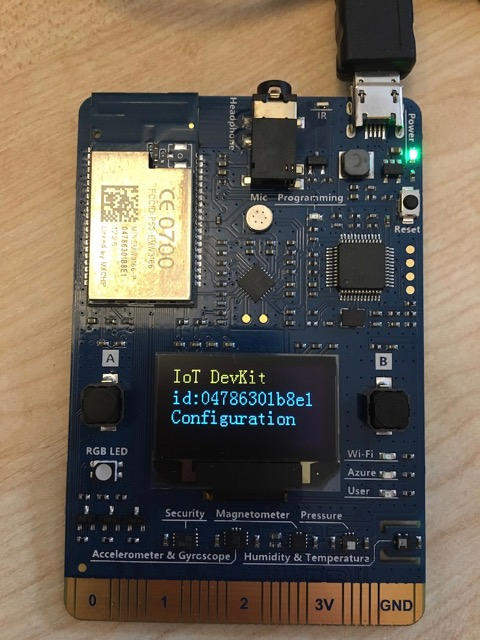
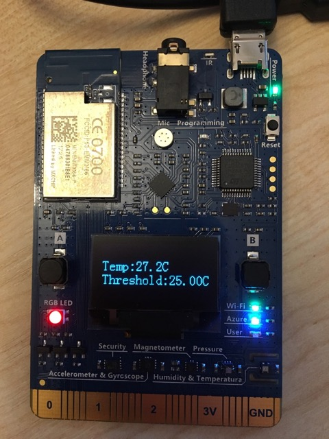
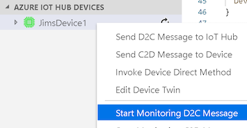
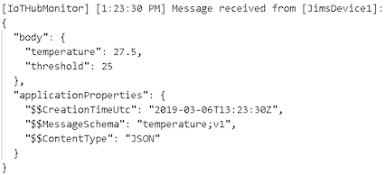

# Send the temperature to Azure IoT Hub

In the [previous step](./ShowingTheTemperature.md) you wrote some code in C to run on the MXChip board. This code checked the temperature and displayed it using the on-board screen and LED. In this step you will connect your board to Azure IoT Hub and send temperature data from the device to the cloud.

## Configure Azure IoT Hub

To use this device with Azure IoT Hub you will need to configure an IoT Hub service, then register your board as a device for that IoT Hub.

### Sign up for Azure

[Azure IoT Hub](https://azure.microsoft.com/services/iot-hub/?WT.mc_id=academic-7372-jabenn) is a cloud service that allows you to control, monitor and deploy to IoT devices at scale, from single devices to billions. To get started with Azure IoT Hub, first you will need an Azure account.

* If you don't already have an Azure account, you can sign up at [azure.microsoft.com/free/](https://azure.microsoft.com/free/?WT.mc_id=academic-7372-jabenn) for free. You will need a credit card for verification purposes, but you will not be billed unless you decide to upgrade to a pay-as-you-go subscription. This free account has all the services available that you will need for this workshop.
* If you are a student aged 18 and up or a teacher, and have an academic email address, you can register at [azure.microsoft.com/free/students](https://azure.microsoft.com/free/students/?WT.mc_id=academic-7372-jabenn). This gives you the same services and credit as the normal free account, but you don't need a credit card to sign up.
* If you already have an Azure account you will be able to use this to create an IoT Hub. There is a free tier that you can use.

### Connect Visual Studio Code to your subscription

* From Visual Studio code, launch the command palette and select *Azure: Sign In*
* Your default web browser will be launched, and from there sign in to your Azure account. Once you are signed in you will be notified that you can close the web page.

### Provision services

#### Azure IoT Hub

* From the command palette, select *Azure IoT Device Workbench: Provision Azure Services*.
* Select the Azure subscription you want to use
* Select *+ Create Resource Group* and name it `temperaturesensor`. You can read more about Resource Groups in the [Resource Manager documentation](https://docs.microsoft.com/azure/azure-resource-manager/resource-group-overview/?WT.mc_id=academic-7372-jabenn).
* Select the Azure region closes to your physical location to create the resource group in
* The palette will show that you will be provisioning the IoT Hub, the IoT Device and an Azure Functions app that will be worked on in a later step, with an arrow pointing to the first step to show where you are in the process. Press *enter* to continue.
* Select *Create a new IoT Hub*
* Select the Azure region closes to your physical location to create the IoT Hub in (you can create resource groups in one location containing resources in another, hence why you will be asked to select the location for each resource)
* Select the tier for your Iot Hub. You want to select the *F1: Free Tier*.
  
  > You can only have one free tier per subscription, so if you have already created a free tier IoT Hub for another project then you will need to select a standard tier (S1/2/3). This workshop will be using Azure device twins in a later step and these are only supported on the free and standard tiers, not the basic tier

* Enter a name for the IoT Hub. This name **MUST** be unique across the internet as it will make up the endpoint URL that you will connect to. `TemperatureSensor` for example will not be available, but `JimsTemperatureSensorMarch2019` might be.
* The IoT Hub will be provisioned and a popup will show the progress. This will take a minute or so.

#### IoT Hub Device

* After this IoT Hub is provisioned, the palette will pop up again showing the three steps, with an arrow pointing to the second step to show you are about to configure an IoT Device. Press *enter* to continue.
* Select *Create a new IoT Hub device*
* Enter a name for your device. This has to be unique per IoT Hub, so if you were provisioning multiple devices you would need a different name for each device. For now use any name. This device will be created and configured inside the IoT Hub.

#### Azure Function app

* The command palette will show the steps again, with the arrow pointing to *Azure Functions*. Press enter to continue.
* Enter a globally unique name for the function app.
* Select the *.NET* runtime.
* The function app will be provisioned, with a pop up showing progress.

## Send messages from the MXChip to the IoT Hub

### Connect to WiFi and Azure IoT Hub

* Open the `device.ino` Arduino sketch file
* In the `setup` method, start the WiFi connection. This will use the SSID and password you configured back in [step 1](./ConfigureTheBoard.md). You can read more about the WiFi API in the [documentation](https://microsoft.github.io/azure-iot-developer-kit/docs/apis/wifi/).

  ```c
  void setup() {
    ...
    WiFi.begin();
  }
  ```

* Create the connection to the Azure IoT Hub after the call to initialize the WiFi.

  ```c
  void setup() {
    ...
    DevKitMQTTClient_Init(true);
  }
  ```

  > The `true` value  being passed in tells the MQTT client to use device twins. These will be covered in a later step.

### Send a message to Azure IoT Hub

* Add some code to send a message to the IoT Hub over MQTT. [MQTT](https://docs.microsoft.com/azure/iot-hub/iot-hub-mqtt-support/?WT.mc_id=academic-7372-jabenn) is a low-level protocol for sending messages from IoT devices, and is the protocol used to communicate with IoT Hub. Create a new method above the `loop` method called `sendData` with the following code:

  ```c
  void sendData(const char *data) {
    time_t t = time(NULL);
    char buf[sizeof "2011-10-08T07:07:09Z"];
    strftime(buf, sizeof buf, "%FT%TZ", gmtime(&t));

    EVENT_INSTANCE* message = DevKitMQTTClient_Event_Generate(data, MESSAGE);

    DevKitMQTTClient_Event_AddProp(message, "$$CreationTimeUtc", buf);
    DevKitMQTTClient_Event_AddProp(message, "$$MessageSchema", "temperature;v1");
    DevKitMQTTClient_Event_AddProp(message, "$$ContentType", "JSON");
  
    DevKitMQTTClient_SendEventInstance(message);
  }
  ```

  This code creates an `EVENT_INSTANCE`, a wrapper around a packet of data containing custom data as well as a header defining the time, schema and format (in this case JSON).

* In the `loop` method, create a JSON string containing the current temperature data after the call to `getSensorData`:

  ```c
  void loop() {
    ...
    char sensorData[200];
    sprintf_s(sensorData,
              sizeof(sensorData),
              "{\"temperature\":%s,\"threshold\":%s}",
              f2s(temperature, 1),
              f2s(temperatureThreshold, 1));
  }
  ```

* Use the `sendData` method to send this JSON document.

  ```c
  sendData(sensorData);
  ```

### Configure the Azure IoT Hub connection string

Each IoT Hub has a connection string that can be used by devices to connect. Instead of setting this programmatically, you can store it inside the MXChips EEPROM, similar to how the SSID and password for the WiFi was stored. The MQTT API will automatically load this connection string and use it when it is initialized.

* On the MXChip board hold down button **A** and press and release the **Reset** button, before releasing button **A**. This will put the board into configuration mode.

  

* From the Visual Studio Code command palette, select *Azure IoT Device Workbench: Configure Device Settings...*
* Select *Config Device Connection String*
* Select *Select IoT Hub Device Connection String*
  * You may see a popup in the bottom left asking you to put the MXChip into configuration mode with instructions on how to do so. Once the device is in configuration mode, click **OK**
* The connection string will be pushed to the EEPROM on the device and be automatically detected and used by the DevKit MQTT libraries.

### Deploy the new device code

* Compile and upload the code to the device. From the command palette select *Azure IoT Device Workbench: Upload Device Code*. Your code will compile and be uploaded to the board.
* Once the code has been compiled and uploaded, the board will reboot and start running your new code.
* Once the connection to WiFi and IoT Hub has been done, you will see the WiFi and Azure LEDs light up.
  
  

### See the messages

You can see a live stream of the messages, including the contents from Visual Studio Code.

* Open the *Explorer* and locate the *AZURE IOT HUB DEVICES* section.
* Expand this and right click on your device.
* Select *Start Monitoring D2C Message*. D2C is short for Device to Cloud.
  
  

* The messages will stream into the *OUTPUT* pane, showing the values sent with each message.
  
  

You can also see telemetry around the messages from the [Azure Portal](https://portal.azure.com/?WT.mc_id=academic-7372-jabenn). This telemetry are usually delayed by a few minutes.

* Head to [portal.azure.com](https://portal.azure.com/?WT.mc_id=academic-7372-jabenn), and log in to your Azure account.
* Search for your IoT Hub using the search box at the top of the portal
  
  

* On the *Overview* page you will see data from the hub, including how many messages have been received. You will also see graphs showing messages over time.
  
  

<hr>

The full code for this sketch file is below:

```c
#include "AZ3166WiFi.h"
#include "DevKitMQTTClient.h"
#include "Sensor.h"

DevI2C *ext_i2c;
HTS221Sensor *ht_sensor;
RGB_LED rgbLed;

static float temperatureThreshold = 25.0;

void initSensor() {
  ext_i2c = new DevI2C(D14, D15);
  ht_sensor = new HTS221Sensor(*ext_i2c);
  ht_sensor->init(NULL);
}

float getSensorData() {
  float temperature;
  ht_sensor->enable();
  ht_sensor->getTemperature(&temperature);
  ht_sensor->disable();
  ht_sensor->reset();

  char buff[16];
  sprintf(buff, "Temp:%sC\r\n", f2s(temperature, 1));
  Screen.print(1, buff);

  sprintf(buff, "Threshold:%sC\r\n", f2s(temperatureThreshold, 1));
  Screen.print(2, buff);

  return temperature;
}

void sendData(const char *data) {
  time_t t = time(NULL);
  char buf[sizeof "2011-10-08T07:07:09Z"];
  strftime(buf, sizeof buf, "%FT%TZ", gmtime(&t));

  EVENT_INSTANCE* message = DevKitMQTTClient_Event_Generate(data, MESSAGE);

  DevKitMQTTClient_Event_AddProp(message, "$$CreationTimeUtc", buf);
  DevKitMQTTClient_Event_AddProp(message, "$$MessageSchema", "temperature;v1");
  DevKitMQTTClient_Event_AddProp(message, "$$ContentType", "JSON");
  
  DevKitMQTTClient_SendEventInstance(message);
}

void setup() {
  initSensor();
  WiFi.begin();
  DevKitMQTTClient_Init(true);
}

void loop() {
  float temperature = getSensorData();

  char sensorData[400];
  sprintf(sensorData,
          "{\"temperature\":%s,\"threshold\":%s}",
          f2s(temperature, 1),
          f2s(temperatureThreshold, 1));

  sendData(sensorData);

  if (temperature > temperatureThreshold) {
    rgbLed.setColor(255, 0, 0);
  }
  else {  
    rgbLed.setColor(0, 0, 255);
  }
  
  delay(5000);
}
```

<hr>

In this step you connected the MXChip to WiFi and Azure IoT Hub, sending the temperature data over MQTT. Now move on to the [next step](./StoreTheTemperature.md) where you will take the temperature and save it to a Cosmos DB collection.