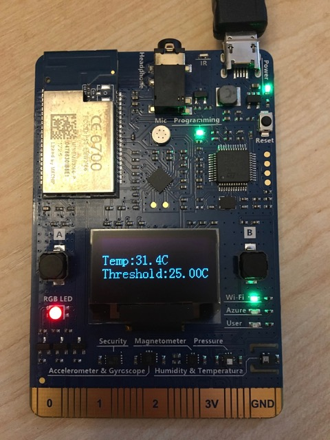

# Show the temperature

In the [previous step](./ConfigureVSCode.md) you configured Visual Studio Code. In this step you will write your first piece of software to run on the MXChip board. The code will query the temperature and show it on the on-board display. It will also light up the LED either blue or red depending on the temperature.

## Create an Arduino project

* From the command palette, select *Azure IoT Device Workbench: Create Project...*
* Select the *IoT DevKit MXChip* board
* Select the *With Azure Functions* project template. This step only deals with the MXChip board software, but later steps will use the Azure IoT hub and an Azure Functions app.
* Browse to a folder to create the project inside.
* Enter a name for the project. For this workshop the name `TemperatureSensor` will be used, so use this name to keep your code consistent with the examples in this workshop.
* Select a language for the Azure Functions app. This workshop will be based on using C#, so select this. **NOTE** be sure to select *C#*, **NOT** *C# Script*

The project will be created, and opened up.

Inside the project you will see two folders - `Device` and `Functions`. `Device` contains the code for the MXChip, and `Functions` contains the Azure Functions app.

### The structure of Arduino apps

Arduino apps are written in sketch files with the extension `.ino`. These are C source files and need to contain at the very least two methods: `setup` and `loop`.

#### The `setup` method

This method is called by the Arduino core when the chip boots up. It should contain all the necessary setup code, such as connecting to WiFi. In the newly created project, this method contains code to connect to WiFi using the SSID you configured back in [step 1](1.ConfigureTheBoard.md), then initialize an MQTT client to talk to Azure IoT Hub. You can ignore this for now as it will be covered in more detail in a later step.

#### The `loop` method

This method is called repeatedly by the Arduino core. You can think of this as analogous to a game loop or message pump. It is called again and again and contains the code you want your board to run, usually with a delay between each call. In the created project it sends a message over MQTT then sleeps for 2,000ms (2 seconds). Once this method completes, it will be called again, then again.

## Write the code

Start by deleting the contents of the `loop` and `setup` methods, as well as the `hasWiFi` and `hasIoTHub` global variables. You will re-implement these entire methods in this and later steps.

### Check the temperature

The MXChip has a built in temperature sensor, and the extensions installed by Visual Studio code provide the APIs to use this.

* Add a `#include` directive for the `Sensor.h` header file to the top of the file, below the other `#include` directives.

  ```c
  #include "Sensor.h"
  ```

* Declare some global variables to access the RGB LED and temperature sensor hardware. Add this code above the `setup` and `loop` methods.

  ```c
  DevI2C *ext_i2c;
  HTS221Sensor *ht_sensor;
  RGB_LED rgbLed;
  ```

  The `DevI2C` is the underlying hardware protocol to talk to devices, the `HTS221Sensor` is a humidity and temperature sensor, and the `RGB_LED` is an RGB LED - that is an LED that can be configured to display any colour using red, green and blue values.

  If you want to read more on the APIs for these components, check out the following docs:

  * [DevI2C and HTS221Sensor](https://microsoft.github.io/azure-iot-developer-kit/docs/apis/hts221/)
  * [RGB_LED](https://microsoft.github.io/azure-iot-developer-kit/docs/apis/led/)

* Add a global variables below this to store the current temperature threshold to control the LED. This value is in °C.

  ```c
  static float temperatureThreshold = 25.0;
  ```

* Create a new method called `initSensor` above the `setup` method, and in this method initialize the sensor.

  ```c
  void initSensor() {
    ext_i2c = new DevI2C(D14, D15);
    ht_sensor = new HTS221Sensor(*ext_i2c);
    ht_sensor->init(NULL);
  }
  ```

* Call this new method from inside the `setup` method.

  ```c
  void setup() {
      initSensor();
  }
  ```

* Create a new method called `getSensorData` above the `loop` method. In this method enable the temperature sensor and read a value from it into a variable.

  ```c
  float getSensorData() {
    float temperature;

    ht_sensor->enable();
    ht_sensor->getTemperature(&temperature);
    ht_sensor->disable();
    ht_sensor->reset();
  }
  ```

* Add code to this method to write the temperature and threshold to the screen. You can read more about the `Screen` API in the [documentation](https://microsoft.github.io/azure-iot-developer-kit/docs/apis/display/).

  ```c
  float getSensorData() {
    ...
    char buff[16];
    sprintf(buff, "Temp:%sC\r\n", f2s(temperature, 1));
    Screen.print(1, buff);

    sprintf(buff, "Threshold:%sC\r\n", f2s(temperatureThreshold, 1));
    Screen.print(2, buff);
  }
  ```

* Return the temperature from this method.

  ```c
  float getSensorData() {
    ...
    return temperature;
  }
  ```

* In the `loop` method, call the `getSensorData` method, storing the return value in a variable.

  ```c
  void loop() {
      float temperature = getSensorData();
  }
  ```

* After getting the sensor data, compare the temperature to the threshold and set the LED based on if it is above or below.

  ```c
  void loop() {
    ...
    if (temperature > temperatureThreshold) {
      rgbLed.setColor(255, 0, 0);
    }
    else {  
      rgbLed.setColor(0, 0, 255);
    }
  }
  ```

  The `setColor` method takes 3 byte values from 0 to 255 for the red, green and blue values for the LED.

* Add a delay at the end of the loop for five seconds (5,000 ms)

  ```c
  void loop() {
    ...
    delay(5000);
  }
  ```

  > The free tier of IoT Hub will process 8,000 messages a day before blocking any more messages. In a later step the `loop` method will send data to the hub. This delay is important to stop the hub being flooded by messages, using up your daily allowance.

* Compile and upload the code to the device. From the command palette select *Azure IoT Device Workbench: Upload Device Code*. Your code will be compiled and uploaded to the board, using the Arduino IDE that you installed earlier. During compilation you will see a load of warnings. Ignore these, but keep a look out for errors.
* Once the code has been compiled and uploaded, the board will reboot and start running your new code.

You will see the temperature displayed, changing every 5 seconds as the temperature changes. Try warming and cooling the sensor using your fingers or by blowing on it and seeing the changes. The LED will change from red to blue as the sensor warms up over 25°C and cools back down.



<hr>

The full code for this sketch file is below:

```c
#include "AZ3166WiFi.h"
#include "DevKitMQTTClient.h"
#include "Sensor.h"

DevI2C *ext_i2c;
HTS221Sensor *ht_sensor;
RGB_LED rgbLed;

static float temperatureThreshold = 25.0;

void initSensor() {
  ext_i2c = new DevI2C(D14, D15);
  ht_sensor = new HTS221Sensor(*ext_i2c);
  ht_sensor->init(NULL);
}

float getSensorData() {
  float temperature;
  ht_sensor->enable();
  ht_sensor->getTemperature(&temperature);
  ht_sensor->disable();
  ht_sensor->reset();

  char buff[16];
  sprintf(buff, "Temp:%sC\r\n", f2s(temperature, 1));
  Screen.print(1, buff);

  sprintf(buff, "Threshold:%sC\r\n", f2s(temperatureThreshold, 1));
  Screen.print(2, buff);

  return temperature;
}

void setup() {
  initSensor();
}

void loop() {
  float temperature = getSensorData();

  if (temperature > temperatureThreshold) {
    rgbLed.setColor(255, 0, 0);
  }
  else {  
    rgbLed.setColor(0, 0, 255);
  }
  
  delay(5000);
}
```

<hr>

In this step you wrote your first piece of code for the MXChip board, detecting the temperature using an onboard sensor and displaying it using a screen and LED. Now move on to the [next step](./SendingTheTemperature.md) where you will connect this board to Azure IoT Hub and send the temperature.