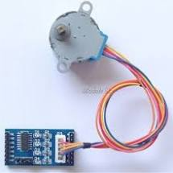
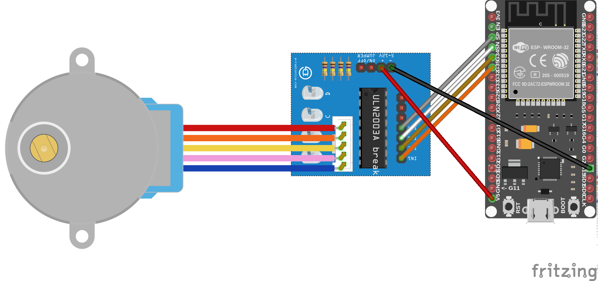
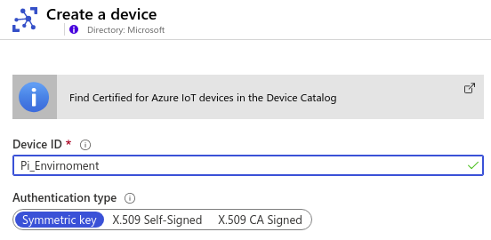
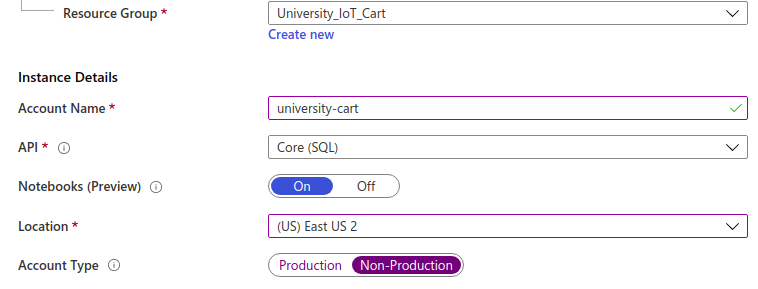

# Step-by-Step Tutorial

## Door Monitor

---

# Purpose

An IoT door can monitor if a door is open or closed.  A user can also go on a web site and lock or unlock the door.  The purpose of this project is to show cloud to device (C2D) and device to cloud (D2C) messages.  We are also using micro controller (MCU).

# Azure Services Used 

1. IoT Hub
2. Stream Analytics
3. Cosmos DB
4. Web App

# Required Hardware

You will need:

1. ESP32


2. Magnet:
    


3. Wire
4. Stepper Motor:




# How to set up hardware

1. We are going to attach the stepper motor with the ULN2003 stepper controller board with the connector.





2, Attach the UNL2003 to the ESP32


<table>
  <tr>
   <td><strong>ESP32</strong>
   </td>
   <td><strong>ULN2003</strong>
   </td>
  </tr>
  <tr>
   <td>GPIO35
   </td>
   <td>LN1
   </td>
  </tr>
  <tr>
   <td>GPIO34
   </td>
   <td>LN2
   </td>
  </tr>
  <tr>
   <td>GPIO39/SVN
   </td>
   <td>LN3
   </td>
  </tr>
  <tr>
   <td>GPIO36/SVP
   </td>
   <td>LN4
   </td>
  </tr>
  <tr>
   <td>V5
   </td>
   <td>+
   </td>
  </tr>
  <tr>
   <td>GND
   </td>
   <td>-
   </td>
  </tr>
</table>


 

Setting up the Cloud

Set up IoT Hub

We are going to set up an IoT Hub with the default values.

**Step 1: **Set up the basics.  Chose a resource group, name of project and subscription.


Step 2: Size and Scale:

For this exercise we are going to use S1 of IoT Hub and have 1 unit of S1.  This will allow us to send 400,000 messages a day.


Step 3: Meta tags

Next, we are going to skip the tags section and go over to Create and Review.

Step 4: Review and create

The final step is to review then create the IoT Hub Resource.


Step 5: Getting a device key

After creating the IoT Hub you will need to get an individual device connection string.  To do this go into your ioT Hub and get the device key.  You can do this by clicking on devices in the side menu and selecting “IoT Devices”.


From here select Add Device.  

Next give your device a name and select Save.





From here select the device in the device list


And save the device connection string for later use.

Step 6: Create a consumer group.

A consumer group give you the ability to have a distributed system read from the same IoT Hub.  We will need a consumer group for Steam Analytics.


Setting up Cosmos DB

Step 1: In the Azure portal create a new Cosmos DB.  Select Core(SQL) as the API, and enable notebooks.





Step 2: Create and Review

Select Create and Review.  Then select Create.

Step 3: Connect to your database

After you create the resource group you will need to create a collection to store the data.  Go to [https://cosmos.azure.com](https://cosmos.azure.com/), login, select your subscription, and the Cosmos Account you just created.

Step 4: Create a Database and Collection

In the GitHub Repo for this project there are 2 iPython notebooks.  Go into the Notebooks of the repository and upload the 2 Notebooks.  Then run the notebook titled Pi_Environment-Monitor-Setup.ipynb by clicking on the Run command.  This notebook will create the database, collection, and user defined function.

Stream Analytics Job

The next step is to create a Stream Analytics Job.  Stream Analytics is a distributed stream processing and aggregation service.  We will use it to put data from IoT Hub to Cosmos DB.

Step 1: Create the Stream Analytics Job

In the Azure Portal create a Stream Analytics Job.  From here give it a name, assign it to a resource group, Gie it a


Step 2: Connect to IoT Hub

We are going to add IoT Hub as an input.  Do to this we will go to the inputs section in Stream Analytics and select the IoT Hub you created and the consumer group you created for that IoT Hub.  For this exercise we are going to ingest the uncompressed JSON telemetry messaging.


Step 3 Output to Cosmos DB

Next, we are going to add an output from Stream Analytics to Cosmos DB.  To do this click on output and add a new Cosmos DB output.  Select the database and collection you created in the previous step.  Leave Document id blank.


Step 4: Query

Next select the “Query” in the menu and in the query editor window put in the following query.

```sql
SELECT GetMetadataPropertyValue(IoTHub, '[IoTHub].[ConnectionDeviceId]') as partitionkey
, GetMetadataPropertyValue(IoTHub, '[IoTHub].[ConnectionDeviceId]') as deviceid 
,DoorStatus 
, EventEnqueuedUtcTime as time 
,device_type 
INTO 
doorstatus 
FROM 
IoTHub  
WHERE device_type = 'door_monitor'
```
In the code we are creating a partition key so that Cosmos DB knows where to store the data.  Next, we are adding the device id, temperature, humidity, and time.

Next, select Save.

Step 5: Running the Job

After you have saved your query, go back to the “Overview” page and click Start.


# Azure Container Registry

Azure container registry allows you to capture iamges of your web app and run them from the image.  To get started go into the Azure Portal and create a new container registry.


To test the container registry follow the quick start instruction on your ACR instance.


After you have completed the test, 


# Getting Ready

For this project we are going to use Visual Studio Code with the PlatformIO extension to compile, upload, and monitor the code on the device.

Clone the repo for this project.  


```sh
git clone name of project

```


Then you will need to cd into the project

```sh
cd IoTDoor 
```

Open Visual Studio Code

```sh

code .

```

Then fine the PlatformIO Icon on the left sidebar and click on it.


Then click on the Open Project button and select the device folder on the project 


# How to do it

From here you will need to set some variables.  The first is the SSIS and Password for the local network.  Then we will enter in the device connection string for this device.


```c
const char* ssid = "Cartnet";
const char* password = "lalalala";
static const char* connectionString = "Your IoTHub Device connection string";
```


When you imported the project into the PlatformIO editor it created a few icons in the bottom of the IDE 


First, we will need to connect the ESP32 with the computer using a usb cable.  Then we can push the check mark to compile the code and then the arrow to deploy the code to the ESP32.

From here we can review test the data going to IoT Hub.  First click on the plug icon in the menu.  This will bring up a serial monitor window where were can see the output from the ESP32.  There are error messages we will see if the device could not connect to the internet or IoT Hub.

Next we can trigger our door sensor by putting a magnet on the Hall Effect sensor 


In the serial monitor you should see a new JSON message when the door changes from open or closed.  In our case It will show open when the magnet is away from the Hall Effect sensor and closed when it is near it.

in your cloned directory for this section naviagte to the web folder in a terminal window. Then build and test the web app locally.


```sh

docker build -t iotdoor .
docker run -d -p 80:89 iotdoor

```


Then login to your ACR instance


```sh

docker login [your ACR name].azurecr.io

```


Use the username and password from the Access keys section in the portal. 


Then tag and push your image to ACR


```sh
docker tag iotdoor [your ACR name].azurecr.io/iotdoor
docker push [your ACR name].azurecr.io/iotdoor
```


Then create a new Azure Web App using a Linux Docker Container


Then go into the docker-compose.yml in visual studio code ant change the image:cartcr.acr.io/iotdoor to the url you uploaded your container to.

Next select on the docker tab select Docker Compose, azure container registry and upload the docker-compose-production.yml 


Then go to the website. 


