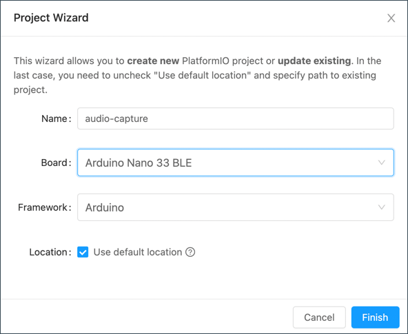

# Create the audio capture tool

In this step you will program the Arduino device to capture audio data ready to classify to train the model.

## Arduino Nano 33 Sense

The Arduino Nano 33 Sense is an Arduino board with a number of sensors, including a microphone which makes it ideal for audio classification. This board is programmed in C++, using Platform IO.

## Platform IO

[Visual Studio Code](http://code.visualstudio.com?WT.mc_id=academic-7372-jabenn) (VS Code) is a free developer text editor that can be expanded with extensions to support multiple features or programming languages.

[Platform IO](https://platformio.org) is an open source extension for VS Code that gives you the ability to program embedded devices without any additional dependencies.

### Install Platform IO

To install Platform IO:

* Make sure you have VS Code installed. If not, you can install it from the [Visual Studio Code Downloads page](https://code.visualstudio.com/Download?WT.mc_id=academic-7372-jabenn)
* From VS Code, select the **Extensions** tab from the side menu

    

1. Search for `PlatformIO` and select the **PlatformIO IDE**. Select the **Install** button to install this extension.

    

> PlatformIO is a self-contained embedded development environment. If you have the Arduino extension installed, it can clash with PlatformIO, so make sure to uninstall the Arduino extension before using PlatformIO.

## Create the project

Once you have PlatformIO installed, it can be used to write the audio capture tool to gather data for classification.

### Create the PlatformIO project

1. From VS Code, select the **PlatformIO** tab from the side menu

    

1. The *PlatformIO: Quick Access* bar will appear. Select *PIO Home->Open*

    

1. From the home screen, select **+ New Project** from the *Quick Access* section

    

1. Name the project `audio-capture`

1. For the *Board*, type in `Arduinno Nano 33 BLE` and select the `Arduinno Nano 33 BLE` board

1. Set the *Framework* to **Arduino**

1. For the location, either leave the default option checked, or uncheck it and select a location for the project. If you hover over the question mark you can see the default project location.

1. Select the **Finish** button

    

PlatformIO will take some time to download the components it needs to use the board, and create the project. Once done, the project will be opened in the VS Code window.

### Navigate the project

The PlatformIO project contains a number of files and folders:

* `.pio` - this folder contains files used by PlatformIO such as the output of the build and other temporary files. You should never need to read or edit any files in this folder. This folder would not normally be checked in to source code control.
* `.vscode` - this folder contains configuration information used by VS Code and may be specific to your PC or Mac, such as paths to library files. You should never need to read or edit any files in this folder.
* `include` - this folder is for any header files for your project that you would want to expose to anyone using your code. This is normally when building libraries for consumption by other developers, and won't be used when writing code for a board.
* `lib` - this folder is for any additional libraries you want to use in your project. PlatformIO has a library manager than can import third party libraries, but if you want to use an additional libraries you need to add them to this folder.
* `src` - this folder is where the source code for your app lives. It will have a single file in it `main.cpp`. This file contains the code for an empty Arduino project.
* `test` - this folder is where you would put any unit test you write against your code.
* `.gitignore` - this is a [`gitignore`](https://git-scm.com/docs/gitignore) file that defines what will be ignored if you add this project to Git source code control.
* `platform.ini` - this file defines the configuration for the PlatformIO project including the board types (PlatformIO projects can target multiple boards), any additional libraries to use, and any build flags to control the code compilation.

This project uses the [Arduino framework](https://www.arduino.cc), an open source framework for software and hardware. When writing arduino code, the core flow is around two methods that are defined in your main source code file. In a PlatformIO project, this file is called `main.cpp`.

* `setup()` - the setup method is called once and only once when the board starts up. This function is used to do one-time setup, such as configuring the microphone or seial port connection.
* `loop()` - the loop method is called after setup, and once the method completes it is called again and again. All the time the board is running, this method will be called as soon as it completes.


## Write the code

The code needs to listen to the microphone and capture data, saving it out in a way that can be used to train a classifier.

Traditionally, audio data is sampled at a rate of many of thousands of values a second - for example low quality audio is sampled at 16KHz, or 16 thousand values every second. This would give a huge amount of inputs to our model, meaning we'd need a large model - something TinyML is trying to avoid. Instead the audio can be averaged out into smaller samples, only a few a second. This gives a less accurate representation of the audio data, but is good enough to distinguish between different sounds. This is done by calculating the root mean square (RMS) value of the sampled input for a period of time.

You can find all the code for this step in the [code/audio-capture](../code/audio-capture) folder.

### Import a library

The code to calculate the RMS value is at the time of writing not shipped with the code to support this Arduino board in PlatformIO. You can get round this by downloading a static library with the implementation that can be linked into your code.

1. Head to the [ARM CMSIS GitHub repo compiled static libraries page](https://github.com/ARM-software/CMSIS_5/tree/5.7.0/CMSIS/DSP/Lib/GCC)

1. Download the `libarm_cortexM4l_math.a` file and add it to the root folder of the project.
    > There are a number of libraries with similar names targetting different M chips, so make sure to download the correct one
1. Open the `platformio.ini` file from the root of the project in VS Code

1. Add the following to the end of the `[env:nano33ble]` section to tell the linker to look for libraries in the root and link this file when building the project:

    ```sh
    build_flags = 
        -L. 
        -l arm_cortexM4l_math
        -w
    ```

    The `-L.` flag tells the linker to look for libraries in the root folder.

    The `-l arm_cortexM4l_math` flag tells the linker to link the `libarm_cortexM4l_math.a` library

    The `-w` flag ignores warnings that come from the Arduino libraries. Although it is generally good practice to find and fix all warnings, in this case the Arduino libraries have warnings that can make it harder to catch errors in your code, so it is easier to ignore them

1. Save the file

    > VS Code has an auto save option if you don't want to have to keep saving files. Enable this by selecting *File -> Auto save*.

### Add code to read audio samples from the microphone

To keep the code cleaner, the code to read from the microphone can be added to a separate file, and this file re-used later when building the audio classifier.

1. In VS Code, create a new file in the `src` folder called `sample_capture.h`. This file will contain code to read the data from the microphone using a standard Arduino library, and calculate the RMS value of periods of audio.

1. Add the following code to this file:

    ```cpp
    #ifndef __SAMPLE_CAPTURE_H__
    #define __SAMPLE_CAPTURE_H__

    #include <PDM.h>
    #include <arm_math.h>

    // The size of the data coming in from the microphone
    #define BUFFER_SIZE 512U

    // 128 samples is enough for 2 seconds of audio - it's captured at 64 samples per second
    #define SAMPLE_SIZE 128
    #define GAIN (1.0f / 50)
    #define SOUND_THRESHOLD 1000

    /**
    * @brief The function signature for the callback function that is called when we have a full set of samples.
    */
    typedef void (*samples_ready_callback)(float*);

    /**
    * @brief A helper class for accessing the BLEs microphone.
    * 
    * Audio data is captured as a full 512 byte data buffer (1/64 second of audio data).
    * Each buffer is then converted into a root mean square value of the buffer to create a smaller
    * representation of the audio.
    * 
    * If this root mean square value is over a threshold (i.e. not silence), then the next SAMPLE_SIZE
    * buffers are captured and the RMS values calculated. Once a full set of samples is retrieved, a
    * callback function is invoked, passing this set of samples.
    * 
    * This essentially converts audio data to a smaller representation for use with training and inference 
    * with TinyML models.
    * For example - 2 seconds of audio * becomes 128 4-byte float values (512 bytes) instead of
    * 32,768 2-byte integerss (65,536 bytes).
    */
    class SampleCapture
    {
    public:
        /**
        * @brief Setup the PDM library to access the microphone at a sample rate of 16KHz
        * @param callback A callback function to call when there is a full set of samples ready.
        * This callback will take the samples as a parameter as a SAMPLE_SIZE array of floats.
        * This array is owned by this class, so the callback will need to take a copy.
        */
        void init(samples_ready_callback callback)
        {
            // Set up the audio callback
            PDMHelper::setSampleCapture(this);

            // Set up the callback when a set of samples is ready
            _callback = callback;

            // Start listening on the microphone at a sample rate of 16KHz
            PDM.begin(1, 16000);
            PDM.setGain(20);
        }

    private:
        /**
        * @brief A helper wrapper class that can connect a method on the SampleCapture object
        * to the PDM callback that expects a static method
        */
        class PDMHelper
        {
        public:
            /**
            * @brief Sets up the PDM callback to a method on the SampleCapture class
            */
            static void setSampleCapture(SampleCapture *sampleCapture)
            {
                // Store the sample capture
                _sampleCapture = sampleCapture;

                // Set up the callback
                PDM.onReceive(PDMHelper::onReceive);
            }

        private:
            /**
            * @brief The callback from the PDM class, calls the SampleCapture update method
            */
            static void onReceive()
            {
                _sampleCapture->onReceive();
            }

            inline static SampleCapture *_sampleCapture;
        };

        /**
        * @brief Reads the audio data from the PDM buffer and calculates the
        * root mean square value, adding it to the samples if needed.
        */
        void onReceive()
        {
            // Check we have a full buffers worth
            if (PDM.available() == BUFFER_SIZE)
            {
                // Read from the buffer
                PDM.read(_buffer, BUFFER_SIZE);

                // Calculate the root mean square value of the buffer
                int16_t rms;
                arm_rms_q15((q15_t *)_buffer, BUFFER_SIZE/sizeof(int16_t), (q15_t *)&rms);

                // If we are not currently collecting samples, check if the RMS value is
                // above our threshold - as in we've heard something, not just silence.
                // If we hear something, start collecting samples
                if (!_started)
                {
                    if (rms > SOUND_THRESHOLD)
                    {
                        _started = true;
                        _position = 0;
                    }
                }

                // If were collecting data, either because we already were, or because we've
                // just detected audio that's not slience, add it to the next slot in the samples
                // array.
                if (_started)
                {
                    // Add the RMS value to the samples array in the next slot, multiplied by a 
                    // gain value to give the signal a boost
                    _samples[_position] = rms * GAIN;

                    // Move to the next slot in the samples
                    _position++;

                    // If we're filled the samples buffer, stop collecting data and call the callback
                    if (_position >= SAMPLE_SIZE)
                    {
                        _started = false;
                        _position = 0;

                        // Pass the samples to the callback
                        _callback(_samples);
                    }
                }
            }
        }

        // The buffer to read from the PDM into - use this as a field to reduce overhead
        // creating and deleteing it every time the buffer is full
        int16_t _buffer[BUFFER_SIZE/sizeof(int16_t)];

        // The samples buffer- use this as a field to reduce overhead
        // creating and deleteing it every time the buffer is full
        float _samples[SAMPLE_SIZE];

        // Are we currently capturing data - we capture from when audio above the SOUND_THRESHOLD
        // is detected, for SAMPLE_SIZE samples
        bool _started;

        // The current position in the samples array to write the next sample to
        int _position;

        // The callback to call when we have a full set of samples
        samples_ready_callback _callback;
    };

    #endif __SAMPLE_CAPTURE_H__
    ```

    This code defines a class called `SampleCapture` that uses the [Arduino `PDM` library](https://www.arduino.cc/en/Reference/PDM) to get data from the microphone at a sample rate of 16KHz, then uses the `arm_math` library to calculate the RMS of the incoming data from the microphone buffer.
    
    The PDM buffer is read in blocks of 256 2-byte values, with each full buffer converted to a single RMS value. If this RMS value is above a threshold - meaning audio has been detected, then recording begins, storing 128 RMS values to represent 2 seconds of data. Once this 2 seconds of data has been captured, a callback is made to pass the data to the rest of the code. This way there's no output diring periods of slience, only when audio is detected.

    You can read the code and the comments to understand how each call works. If you need to change the length of data sampled, change the value of `SAMPLE_SIZE` to the number of seconds needed multiplied by 64. For example, if you only need 1 second of data, set `SAMPLE_SIZE` to be 64. To keep this model small, set this to be as small as possible.

1. Save the file

### Add the program code

The main program now needs to be written to read data from the microphone at regular intervals, then output the 2 seconds of RMS values to the serial port. The data that is captured needs to be stored somewhere so that it can be used to train the model, and the easiest way to do this is to output it from the Arduino device to the serial port, then monitor that serial port using PlatformIO.

1. Open the `main.cpp` file

1. Replace the existing code in this file with the following:

    ```cpp
    // Copyright (c) Microsoft Corporation.
    // Licensed under the MIT license.

    /**
    * Audio Capture
    * 
    * This program listens on the microphone capturing audio data and writing it out as
    * CSV file lines to the serial port.
    * 
    * Audio data is captured as a full 512 byte data buffer (1/64 second of audio data).
    * Each buffer is then converted into a root mean square value of the buffer to create a smaller
    * representation of the audio.
    * 
    * If this root mean square value is over a threshold (i.e. not silence), then the next SAMPLE_SIZE
    * buffers are captured and the RMS values calculated. Once a full set of samples is retrieved, a
    * callback function is invoked, passing this set of samples.
    * 
    * The default for SAMPLE_SIZE is 128 - 2 seconds of audio data. You can configure this in the 
    * sample_capture.h header file.
    * 
    * This essentially converts audio data to a smaller representation for use with training TinyML models.
    * For example - 2 seconds of audio * becomes 128 4-byte float values (512 bytes) instead of
    * 32,768 2-byte integerss (65,536 bytes).
    * 
    * The output sent to the serial port can be saved as a CSV file and used to train the model
    * 
    */

    #include "sample_capture.h"

    // A helper class that captures audio from the microphone
    SampleCapture sampleCapture;

    // A buffer used to store data read from the Sample Capture class
    float _samples[SAMPLE_SIZE];

    // Tracks if we have samples ready to log to the serial port
    bool _ready;

    /**
    * @brief A callback that is called whenever the sample capture object has a full buffer of audio
    * RMS values ready for processing
    */
    void onSamples(float *samples)
    {
        memcpy(_samples, samples, SAMPLE_SIZE * sizeof(float));
        _ready = true;
    }

    /**
    * @brief Process the samples, writing them out to the serial port
    */
    void procesSamples()
    {
        // print the audio data to serial port
        for (int i = 0; i < SAMPLE_SIZE; i++)
        {
            Serial.print(_samples[i], 6);

            // Seperate the audio values with commas, at the last value
            // send a newline
            Serial.print(i == SAMPLE_SIZE - 1 ? '\n' : ',');
        }
    }

    /**
    * @brief Sets up the serial port and the sample capture object
    */
    void setup()
    {
        // Start the serial connection so the captured audio data can be output
        Serial.begin(115200);

        // Start the sample capture object to listen for audio and callback when
        // it has a full set of samples
        sampleCapture.init(onSamples);

        // Wait 3 seconds for everything to get started
        delay(3000);
    }

    /**
    * @brief Runs continuously capturing audio data and writing it to
    * the serial port
    */
    void loop()
    {
        // check to see if we have audio data
        if (_ready)
        {
            // If we do, mark it as read ready for the next loop
            _ready = false;

            // Process the samples
            procesSamples();
        }

        // Sleep to allow background microphone processing
        // Each sample is 2 seconds, so sleeping for 1 second is fine
        delay(1000);
    }
    ```

    This code sets up the sample capture object in the `setup` function, registering a callback that is called with the 128 samples every time audio is detected. When the callback is called, a copy of the data is made, and a flag is set to indicate data is ready. This is then detected in the `loop` function, and written to the console in a call to `procesSamples`.

1. Save the file

## Run the code

Now the code is written, it can be deployed to the Arduino device and run to capture data.

### Upload the code to the device

 1. Connect your Arduino board to your PC or Mac using a USB cable

1. From Visual Studio Code, launch the Command Palette. This is a pop-up menu that allows you to run actions from VS Code as well as any extensions installed.

    1. If you are using Windows or Linux, press `Ctrl+Shift+p`
    1. If you are using macOS, press `Command+Shift+p`

1. Search for `PlatformIO: Upload` by typing in the box, then select that option

    

The relevant tooling will be installed, and the code will be compiled for the device. Once built, it will be uploaded to the Arduino. You will see the progress in the VS Code terminal.

```output
Linking .pio/build/nano33ble/firmware.elf
Checking size .pio/build/nano33ble/firmware.elf
Building .pio/build/nano33ble/firmware.bin
Advanced Memory Usage is available via "PlatformIO Home > Project Inspect"
RAM:   [==        ]  16.8% (used 44080 bytes from 262144 bytes)
Flash: [=         ]   8.2% (used 80236 bytes from 983040 bytes)
================================================ [SUCCESS] Took 12.28 seconds ================================================
```

### Monitor the output

The serial output of the Arduino is the USB cable that is used to connect it to your PC or Mac. You can monitor the data being sent using the PlatformIO serial monitor.

1. Launch the serial monitor using one of these methods:
    * Open the VS Code Command Palette, search for `PlatformIO: Serial Monitor` and select this option

        

    * Select the Serial Monitor button from the status bar

        

The serial monitor will listen for all messages from the device. You'll see nothing in the output to start with.

### Capture audio data

To train the model, you will need multiple audio samples for each label you want to classify - for example if you want to detect the difference between "Yes" and "No", you will need multiple samples for the word "Yes", and multiple for the word "No". Ideally you'd want between 15-30 samples per label.

1. Make the relevant sound into the microphone on the Arduino device, either by speaking in to it, or playing the relevant audio. You will see a line of samples appear on the serial monitor output.

1. Repeat this multiple times, slightly adjusting the position of the microphone relative to the audio. You want 15-30 samples. Each new sample will be a new line.

    ```output
    > Executing task: pio device monitor <

    --- Available filters and text transformations: colorize, debug, default, direct, hexlify, log2file, nocontrol, printable, send_on_enter, time
    --- More details at http://bit.ly/pio-monitor-filters
    --- Miniterm on /dev/cu.usbmodem101  9600,8,N,1 ---
    --- Quit: Ctrl+C | Menu: Ctrl+T | Help: Ctrl+T followed by Ctrl+H ---
    25.599998,42.820000,13.540000,31.559999,43.279999,45.919998,46.059998,44.919998,40.459999,29.840000,30.500000,27.799999,23.459999,19.139999,16.980000,9.559999,8.860000,6.260000,0.000000,3.620000,0.000000,3.620000,8.080000,11.440000,12.540000,15.339999,14.020000,14.020000,12.000000,10.860000,8.860000,6.260000,3.620000,0.000000,0.000000,0.000000,3.620000,3.620000,6.260000,8.860000,9.559999,10.860000,11.440000,12.540000,13.040000,13.540000,14.020000,14.920000,15.780000,16.180000,16.580000,16.580000,16.980000,16.980000,17.359999,16.980000,16.580000,16.180000,15.780000,14.920000,14.480000,13.540000,13.040000,12.540000,11.440000,10.860000,10.219999,9.559999,8.860000,8.080000,8.080000,7.240000,7.240000,6.260000,6.260000,5.100000,5.100000,5.100000,5.100000,3.620000,3.620000,3.620000,3.620000,3.620000,3.620000,0.000000,0.000000,0.000000,0.000000,0.000000,0.000000,0.000000,0.000000,0.000000,0.000000,0.000000,0.000000,0.000000,0.000000,0.000000,0.000000,0.000000,0.000000,0.000000,0.000000,0.000000,0.000000,0.000000,0.000000,0.000000,0.000000,0.000000,0.000000,0.000000,0.000000,0.000000,0.000000,0.000000,0.000000,0.000000,0.000000,0.000000,0.000000,0.000000,0.000000,0.000000,0.000000,0.000000
    38.299999,34.139999,31.139999,27.799999,19.480000,7.240000,7.240000,8.860000,17.719999,20.779999,23.740000,21.400000,21.100000,20.779999,18.459999,15.339999,10.860000,5.100000,3.620000,0.000000,0.000000,0.000000,0.000000,0.000000,3.620000,3.620000,5.100000,5.100000,6.260000,8.080000,9.559999,11.440000,12.540000,14.020000,14.480000,15.339999,15.780000,16.180000,16.980000,17.359999,17.719999,18.100000,17.719999,17.719999,16.980000,16.580000,15.780000,15.339999,14.480000,13.540000,12.540000,12.000000,10.860000,10.219999,8.860000,8.860000,8.080000,7.240000,7.240000,6.260000,5.100000,5.100000,5.100000,3.620000,3.620000,3.620000,0.000000,0.000000,0.000000,0.000000,0.000000,0.000000,0.000000,0.000000,0.000000,0.000000,0.000000,0.000000,0.000000,0.000000,0.000000,0.000000,0.000000,0.000000,0.000000,0.000000,0.000000,0.000000,0.000000,0.000000,0.000000,0.000000,0.000000,0.000000,0.000000,0.000000,0.000000,0.000000,0.000000,0.000000,0.000000,0.000000,0.000000,0.000000,0.000000,0.000000,0.000000,0.000000,0.000000,0.000000,0.000000,0.000000,0.000000,0.000000,0.000000,0.000000,0.000000,0.000000,0.000000,0.000000,0.000000,0.000000,0.000000,0.000000,0.000000,0.000000,0.000000,0.000000
    ```

1. Copy all the data from the serial monitor into a text file. Save this as `<label>.csv` - a comma-separated values file. Replace `<label>` with the label you want to use for this audio, for example if you captured saying the word "Yes" then save this as `Yes.csv`. You only want the audio samples, so ignore the monitor output before the samples.

1. Clear the serial monitor output by right-clicking and selecting *Clear* and repeat this for the other labels you want to classify.

## Next steps

In this step you programed the Arduino device to capture audio data ready to classify to train the model. In the [next step](./train-model.md) you will use the output from the audio capture to train a TinyML model.
